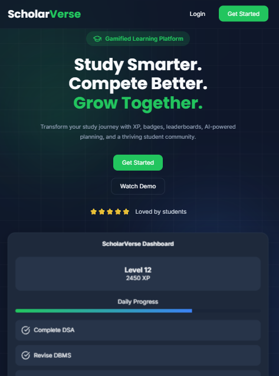
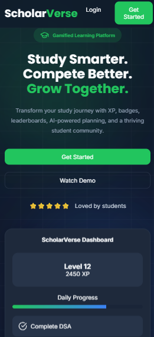

# 🎓 ScholarVerse

> **Study Smarter. Compete Better. Grow Together.**

A modern gamified learning platform designed to transform the way students learn, collaborate, and achieve their academic goals.

ScholarVerse combines **AI-powered study planning**, **gamification**, **community learning**, and **career opportunities** into a single platform built for students.

---

## 🚀 Project Status

> **Currently Under Active Development**

### Completed ✅

- Modern Landing Page
- Responsive UI
- Modular CSS Architecture
- Design System
- Lucide Icons
- Project Documentation

### In Progress 🚧

- Authentication System
- Backend Development
- MongoDB Integration

### Upcoming 📌

- Smart Study Planner
- XP & Badge System
- Community
- Career Hub
- AI Study Coach
- Leaderboard

## 📸 Preview

### Desktop

### Tablet

### Mobile

## ✨ Features

### 🎯 Smart Learning

- AI-powered study planner
- Adaptive study schedule
- Daily missions
- Revision reminders

### 🎮 Gamification

- XP System
- Level Progression
- Badges
- Daily Streaks
- Achievements

### 👥 Community

- Discussion Feed
- Study Groups
- Peer Support
- Mentor Guidance

### 💼 Career Hub

- Job Updates
- Internship Opportunities
- Scholarships
- Hackathons
- Placement Experiences
- Certification Resources

### 📊 Analytics

- Progress Dashboard
- Learning Insights
- Weekly Reports
- Study Statistics

