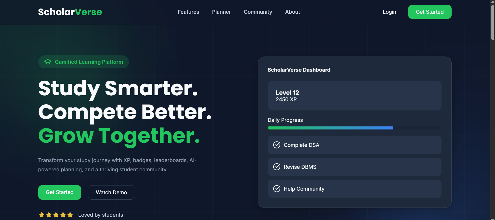
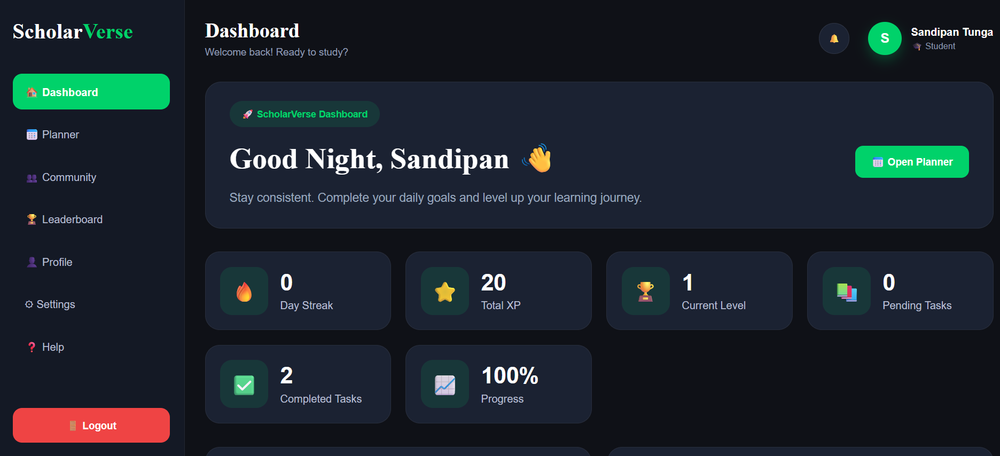
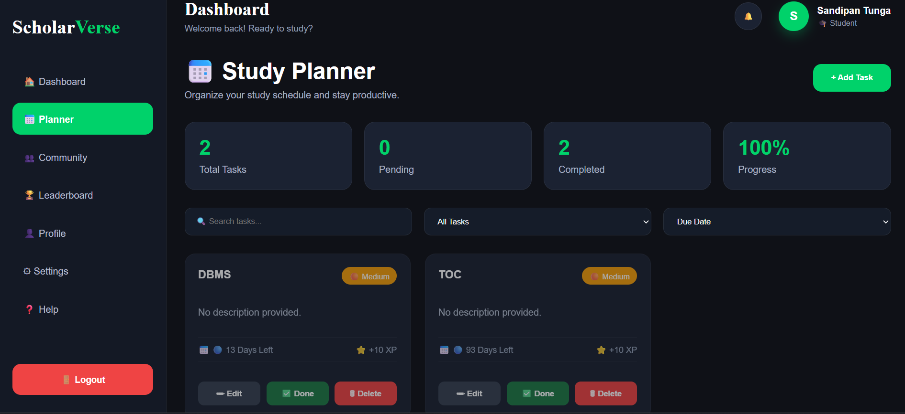
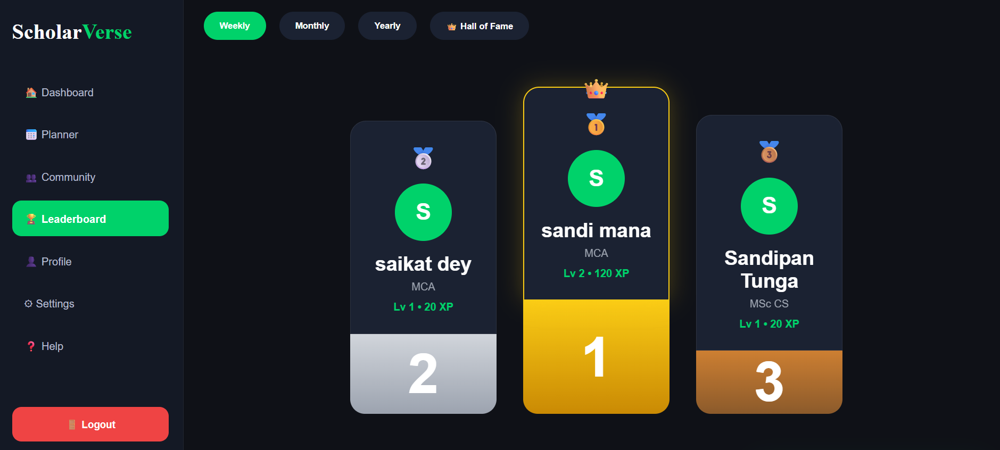
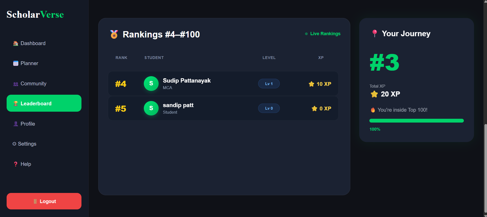

# 🎓 ScholarVerse

> **Study Smarter. Compete Better. Grow Together.**

ScholarVerse is a modern gamified learning platform built to help students stay organized, motivated, and career-ready.

Instead of being just another study planner, ScholarVerse combines **task management**, **gamification**, **analytics**, **community learning**, and **career resources** into one unified platform.

---

# 🚀 Current Status

> 🚧 Actively Under Development

### ✅ Completed

- Modern Responsive Landing Page
- Authentication System (Login / Register)
- JWT Authentication
- Protected Dashboard
- Smart Study Planner
- XP & Level System
- Live Leaderboard
- Weekly Season Leaderboard
- User Journey Card
- MongoDB Database Integration
- REST API
- Modular CSS Architecture
- Responsive Foundation

---

### 🚧 Currently Working On

- Achievement & Badge System
- Profile Page
- Notification Center

---

### 📌 Planned Features

- Community Feed
- Study Groups
- Career Hub
- AI Study Coach
- Admin Dashboard
- Leaderboard Seasons
- Daily Challenges
- Mobile Optimization

---

# 📸 Preview

## Landing Page



## Dashboard



## Planner



## Leaderboard




---

# ✨ Features

## 📅 Smart Study Planner

- Create study tasks
- Daily planner
- Task completion tracking
- Automatic XP rewards
- Progress overview

---

## 🏆 Gamification

- XP System
- Level Progression
- Weekly Rankings
- Live Leaderboard
- User Journey
- Future Achievement System

---

## 📊 Dashboard

- Learning Statistics
- XP Progress
- Current Level
- Planner Overview
- Productivity Widgets

---

## 👤 Authentication

- Secure Registration
- JWT Login
- Password Encryption
- Protected Routes

---

## 💼 Career Hub (Upcoming)

- Jobs
- Internships
- Scholarships
- Hackathons
- Certifications

---

## 👥 Community (Upcoming)

- Discussion Feed
- Notes Sharing
- Study Groups
- Peer Support
- Mentor Connect

---

# 🛠 Tech Stack

### Frontend

- HTML5
- CSS3
- JavaScript (ES6)

### Backend

- Node.js
- Express.js

### Database

- MongoDB
- Mongoose

### Authentication

- JWT
- bcrypt

### Tools

- Git
- GitHub
- VS Code
- Postman

---

# 📂 Project Structure

```
ScholarVerse
│
├── frontend
│   ├── assets
│   ├── css
│   ├── js
│   └── pages
│
├── backend
│   ├── controllers
│   ├── middleware
│   ├── models
│   ├── routes
│   ├── services
│   └── utils
│
├── docs
└── README.md
```

---

# 🎯 Vision

ScholarVerse aims to become an all-in-one student platform where learners can:

- 📚 Plan their studies
- 🎮 Stay motivated through gamification
- 📈 Track academic progress
- 👥 Learn with the community
- 💼 Discover career opportunities
- 🤖 Get AI-powered study assistance

---

# 📅 Roadmap

## Phase 1 ✅
- Landing Page
- Authentication
- Dashboard
- Planner
- Leaderboard

## Phase 2 🚧
- Achievements
- Profile
- Notifications

## Phase 3
- Community
- Career Hub
- AI Study Coach
- Admin Panel

---

## ⭐ Support

If you like this project, consider giving it a ⭐ on GitHub!